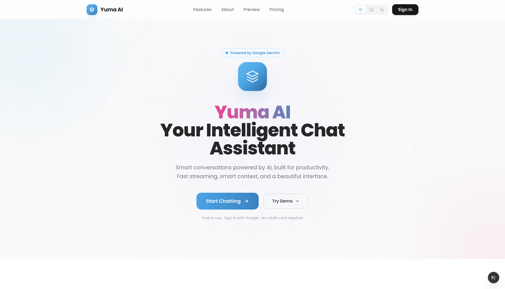
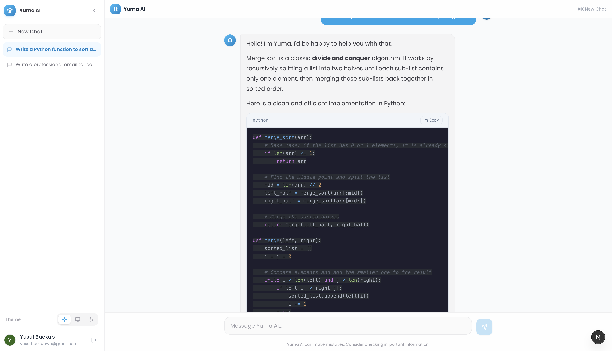
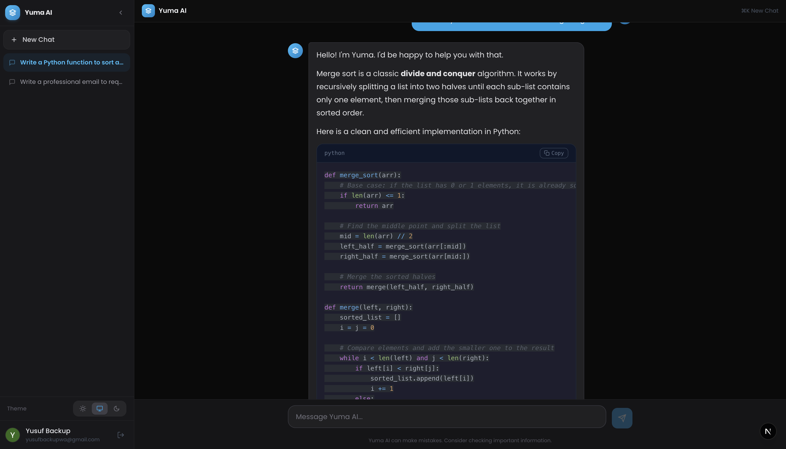

# 🚀 Yuma AI — Modern AI Chatbot SaaS

<!--  -->

A premium, full-stack AI chatbot SaaS application powered by **Google Gemini**. Features real-time streaming responses, Google SSO authentication, multi-conversation support, and a beautiful landing page with smooth Framer Motion animations.

---

## 📸 Screenshots

### 1. Landing Page

A modern, conversion-optimized interface featuring smooth scroll-reveal animations and consistent branding.

### 2. Chat Interface

Real-time streaming responses with context memory, markdown support, and an intuitive sidebar.

### 3. Light / Dark Mode

Fully responsive design with system-aware light and dark modes.

_(Note: Replace the image paths above with your actual screenshots in the `frontend/public/` folder)_

---

## ✨ Features

| Feature                     | Description                                                   |
| --------------------------- | ------------------------------------------------------------- |
| 🤖 **AI Chat**              | Real-time streaming responses via Google Gemini API (SSE)     |
| 🔐 **Google SSO**           | Auth.js v5 authentication with JWT sessions                   |
| 💬 **Multi-Conversation**   | Create, switch, and delete multiple chat threads              |
| 🧠 **Context Memory**       | AI remembers full conversation history for smarter replies    |
| 📝 **Markdown Rendering**   | Code blocks with syntax highlighting, tables, lists, and more |
| 🗑️ **Delete Conversations** | Owner-only deletion with confirmation modal                   |
| 📁 **Collapsible Sidebar**  | Full width ↔ icons-only mode, persisted in localStorage       |
| 🌗 **Theme Support**        | Light / Dark / System mode with smooth transitions            |
| ⌨️ **Keyboard Shortcuts**   | `⌘K` / `Ctrl+K` for new chat                                  |
| 🎨 **Premium Landing Page** | 7-section SaaS page with Framer Motion animations             |
| 📱 **Fully Responsive**     | Optimized for desktop, tablet, and mobile                     |

---

## 🏗️ Tech Stack

### Frontend

- **Next.js 16** — App Router, Turbopack
- **Tailwind CSS v4** — Utility-first styling
- **Framer Motion** — Scroll-reveal, staggered, and spring animations
- **Auth.js v5** — Google SSO with JWT strategy
- **Zustand** — State management with persist middleware
- **next-themes** — Light / Dark / System theme toggle

### Backend

- **Node.js + Express** — REST API server
- **Google Gemini API** — AI model (`gemini-3.1-flash-lite-preview`)
- **MySQL** — Relational database
- **Prisma ORM v7** — Type-safe database client with driver adapters
- **SSE** — Server-Sent Events for real-time streaming

---

## 📄 License

This project is for educational and portfolio purposes.

---

  <b>Built with ❤️ using Next.js, Express, MySQL, Prisma, and Google Gemini</b>

